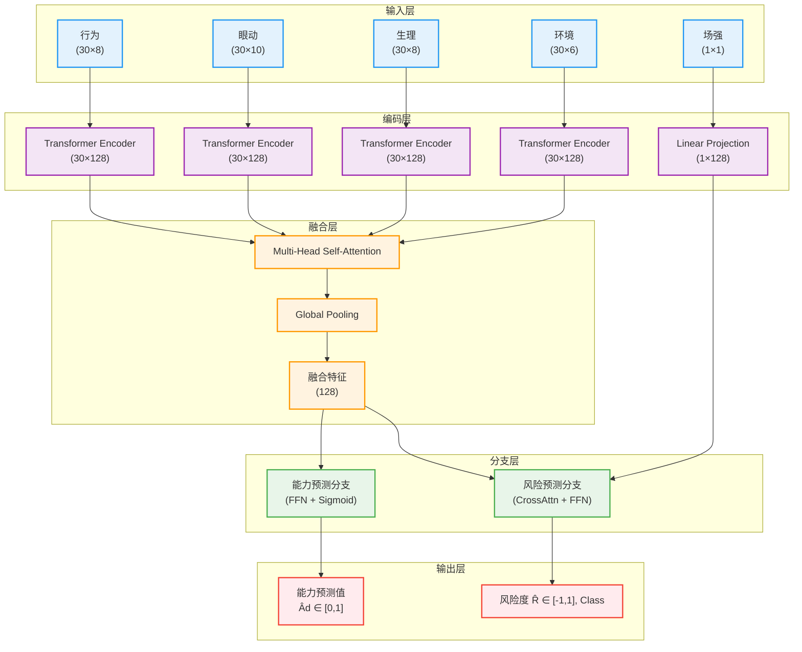

```mermaid
flowchart TD
    %% 定义样式类
    classDef input fill:#e3f2fd,stroke:#2196f3,stroke-width:2px;
    classDef encoder fill:#f3e5f5,stroke:#9c27b0,stroke-width:2px;
    classDef fusion fill:#fff3e0,stroke:#ff9800,stroke-width:2px;
    classDef branch fill:#e8f5e9,stroke:#4caf50,stroke-width:2px;
    classDef output fill:#ffebee,stroke:#f44336,stroke-width:2px;

    subgraph 输入层
        direction TB
        In1["行为\n(30×8)"]:::input
        In2["眼动\n(30×10)"]:::input
        In3["生理\n(30×8)"]:::input
        In4["环境\n(30×6)"]:::input
        In5["场强\n(1×1)"]:::input
    end

    subgraph 编码层
        direction TB
        E1["Transformer Encoder\n(30×128)"]:::encoder
        E2["Transformer Encoder\n(30×128)"]:::encoder
        E3["Transformer Encoder\n(30×128)"]:::encoder
        E4["Transformer Encoder\n(30×128)"]:::encoder
        E5["Linear Projection\n(1×128)"]:::encoder
    end

    subgraph 融合层
        direction TB
        MHSA["Multi-Head Self-Attention"]:::fusion
        Pool["Global Pooling"]:::fusion
        Fusion["融合特征\n(128)"]:::fusion
    end

    subgraph 分支层
        direction TB
        B1["能力预测分支\n(FFN + Sigmoid)"]:::branch
        B2["风险预测分支\n(CrossAttn + FFN)"]:::branch
    end

    subgraph 输出层
        direction TB
        Out1["能力预测值\nÂd ∈ [0,1]"]:::output
        Out2["风险度 R̂ ∈ [-1,1], Class"]:::output
    end

    %% 连接关系
    In1 --> E1
    In2 --> E2
    In3 --> E3
    In4 --> E4
    In5 --> E5

    E1 --> MHSA
    E2 --> MHSA
    E3 --> MHSA
    E4 --> MHSA
    
    MHSA --> Pool
    Pool --> Fusion
    
    Fusion --> B1
    Fusion --> B2
    E5 --> B2
    
    B1 --> Out1
    B2 --> Out2
```