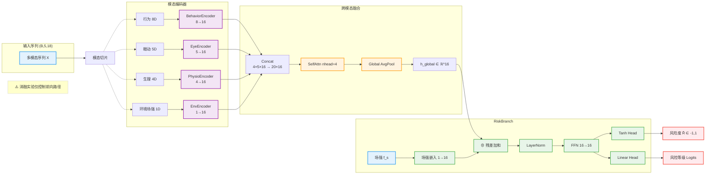

```mermaid
flowchart LR
    %% 样式定义
    classDef input fill:#e3f2fd,stroke:#2196f3,stroke-width:2px;
    classDef encoder fill:#f3e5f5,stroke:#9c27b0,stroke-width:2px;
    classDef fusion fill:#fff3e0,stroke:#ff9800,stroke-width:2px;
    classDef head fill:#e8f5e9,stroke:#4caf50,stroke-width:2px;
    classDef output fill:#ffebee,stroke:#f44336,stroke-width:2px;
    classDef bypass stroke-dasharray: 5 5,stroke:#666;

    %% --- 输入层（严格ASCII标识）---
    subgraph Input["输入序列 (B,5,18)"]
        X[多模态序列 X]
    end
    X:::input

    %% 模态切片
    Slice[模态切片] 
    Slice -.-> BehSlice[行为 8D]
    Slice -.-> EyeSlice[眼动 5D]
    Slice -.-> PhySlice[生理 4D]
    Slice -.-> EnvSlice[环境场强 1D]
    X --> Slice

    %% --- 编码层 ---
    subgraph ENC[模态编码器]
        EBeh[BehaviorEncoder<br>8→16]:::encoder
        EEye[EyeEncoder<br>5→16]:::encoder
        EPhy[PhysioEncoder<br>4→16]:::encoder
        EEnv[EnvEncoder<br>1→16]:::encoder
        
        BehSlice --> EBeh
        EyeSlice --> EEye
        PhySlice --> EPhy
        EnvSlice --> EEnv
    end

    %% --- 融合层 ---
    subgraph FUSE[跨模态融合]
        Concat[Concat<br>4×5×16 → 20×16]
        CA[SelfAttn nhead=4]:::fusion
        Pool[Global AvgPool]:::fusion
        HGlobal[h_global ∈ ℝ^16]
        
        EBeh --> Concat
        EEye --> Concat
        EPhy --> Concat
        EEnv --> Concat
        Concat --> CA
        CA --> Pool
        Pool --> HGlobal
    end

    %% --- 预测头 ---
    subgraph HEAD[RiskBranch]
        FS[场强 f_s]:::input
        Emb[场强嵌入 1→16]:::head
        Add[⊕ 残差加和]:::head
        Norm[LayerNorm]:::head
        FFN[FFN 16→16]:::head
        Reg[Tanh Head]:::head
        Cls[Linear Head]:::head
        
        HGlobal --> Add
        FS --> Emb --> Add
        Add --> Norm --> FFN
        FFN --> Reg
        FFN --> Cls
    end

    %% --- 输出 ---
    OutReg[风险度 R̂ ∈ -1,1]:::output
    OutCls[风险等级 Logits]:::output
    Reg --> OutReg
    Cls --> OutCls

    %% 消融注释
    Note[⚠️ 消融实验仅控制前向路径] 
    style Note fill:#ffffcc,stroke:#ccc
```